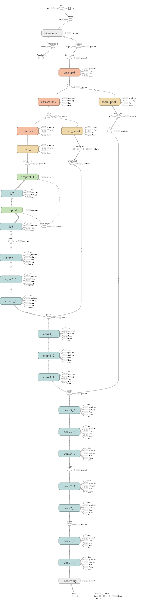
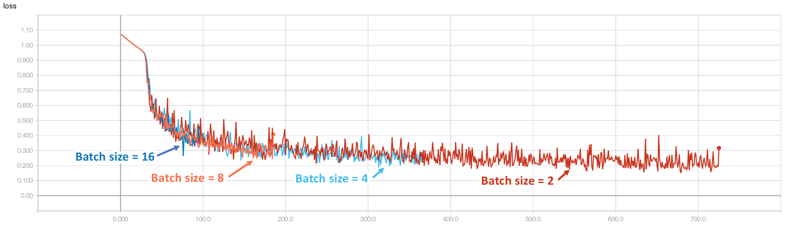
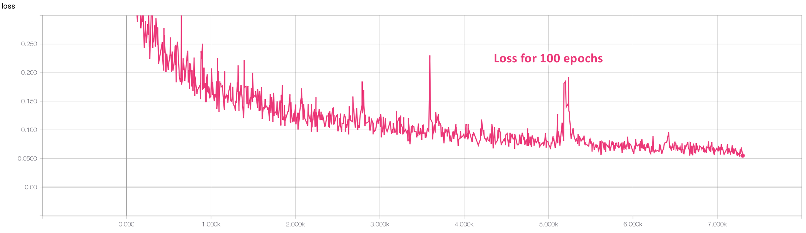
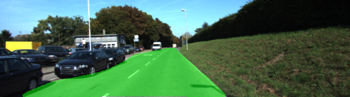
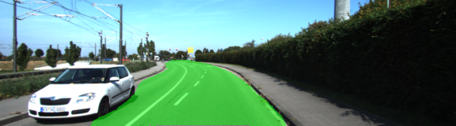
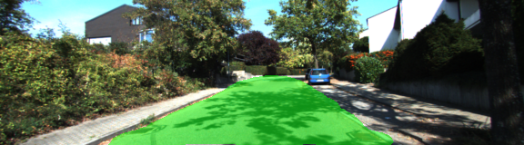
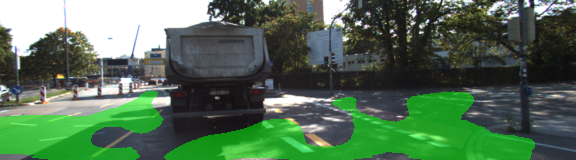
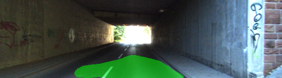
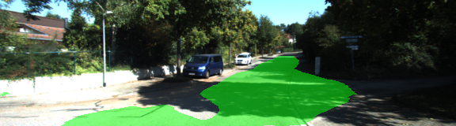
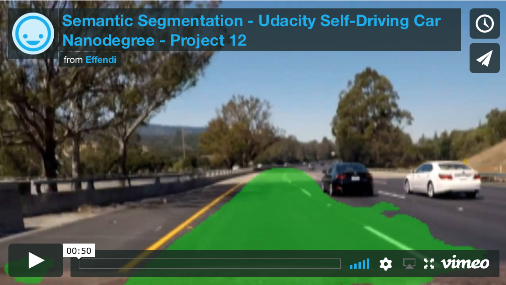

# **Semantic Segmentation**

**Udacity Self Driving Car Nanodegree - Project #12**

2018/02/19

## Overview

This project implements a **Fully Convolutional Network** in Python with TensorFlow to perform **Semantic Segmentation** to **identify road pixels in images**.

The network architecture follows the [FCN-8s structure](https://people.eecs.berkeley.edu/~jonlong/long_shelhamer_fcn.pdf), starting with a **pretrained VGG16** feature encoder with added **1x1 convolutions** to reduce the number of classes to 2 ("road" and "not road") and upscaling by **transposed convolutions** back to the original image size.  **Skip layers** are connected from layer 3 ("pool3") and layer 4 ("pool4") to improve the upscaled classification resolution.  See the TensorBoard graph diagram below for details.

*TensorBoard graph diagram:*



The network was trained on the **KITTI dataset** (289 images) for 100 epochs with batch size of 4.  Initially, various batch sizes (2, 4, 8, 16) were compared but did not show any significant differences in the loss trend, so 4 was kept as the final value to balance sample size per batch with GPU memory usage.

*Loss trend comparing various batch sizes:*



*Final loss trend for 100 epochs (batch size = 4):*



After training, the test images were processed to highlight the detected road pixels in green.  The network was also applied to a Udacity test video from a previous [lane detection project](https://github.com/edufford/CarND-Advanced-Lane-Lines-P4) to check for its ability to generalize for a different road environment.  See the Project Result section below.

## Project Result:

#### Examples from KITTI dataset test images

*Good detection:*





*Poor detection:*






#### Video of network applied to Udacity test video from lane detection project

[](https://vimeo.com/256504010)

## Key Files

| File                           | Description                                                                                                                   |
|:------------------------------:|:-----------------------------------------------------------------------------------------------------------------------------:|
| main.py                        | Source code for **main algorithm** that trains, tests, and processes video using the implemented **FCN-8s architechture**     |
| helper.py                      | Source code for **helper functions** that download VGG16 pretrained model, generate training batches, and process test images |
| project_tests.py               | Source code for **function tests** that check the basic function implementation validity                                      |
| /data/vgg/                     | Pretrained **VGG16** model files (automatically downloaded on first run)                                                          |
| /data/data_road/               | **KITTI dataset** training and testing images (see Dataset section below for download instructions)                               |
| /runs/1519080543.551802-100ep/ | **Processed test image result output** for last run (after training for 100 epochs with batch size 4)                         |
| /video/project_video-100ep.mp4 | **Processed Udacity test video** for optional generalization check                                                            |

The original Udacity project repository is [here](https://github.com/udacity/CarND-Semantic-Segmentation).

## Dataset

Download the [KITTI Road dataset](http://www.cvlibs.net/datasets/kitti/eval_road.php) from [here](http://www.cvlibs.net/download.php?file=data_road.zip).  Extract the dataset in the `data` folder.  This will create the folder `data_road` with all the training a test images.

## How to Run Code

1. Install the following dependencies:

    * Python v3.6
    * TensorFlow v1.5
    * NumPy
    * Pillow
    * SciPy
    * ffmpeg
    * imageio v2.1.2
    * MoviePy

    -or- use Anaconda to install the environment from [Udacity Object Detection Lab](https://github.com/udacity/CarND-Object-Detection-Lab)

2. Download the KITTI dataset (see Dataset section above).

3. Run **main.py** with the following usage:

```
usage: main.py [-h] [-md MODE] [-ep EPOCHS] [-bs BATCH_SIZE] [-lr LEARN_RATE]

optional arguments:
  -h, --help            show this help message and exit
  -md MODE, --mode MODE
                        mode [1]: 0=Train, 1=Test, 2=Video
  -ep EPOCHS, --epochs EPOCHS
                        epochs [20]
  -bs BATCH_SIZE, --batch_size BATCH_SIZE
                        batch size [4]
  -lr LEARN_RATE, --learn_rate LEARN_RATE
                        learning rate [0.0001]
```
